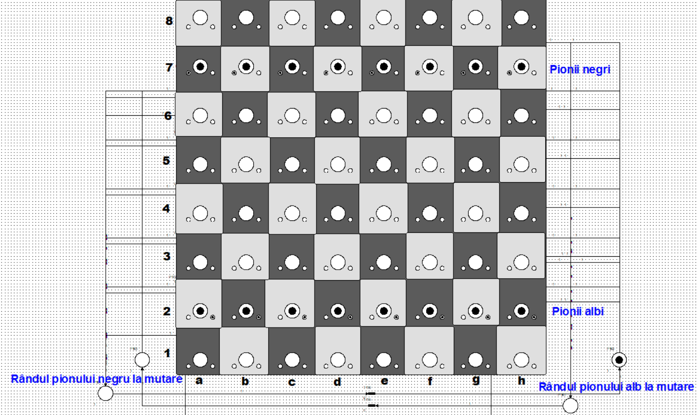
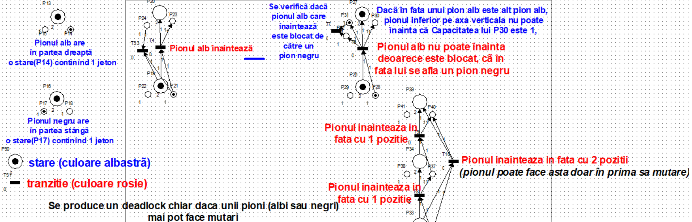
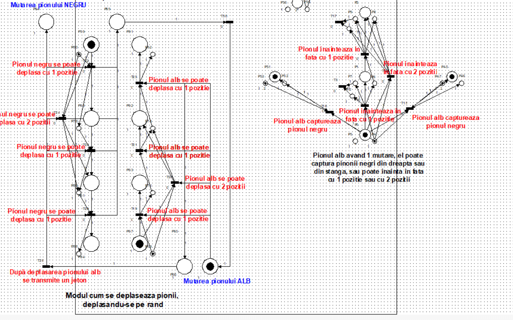
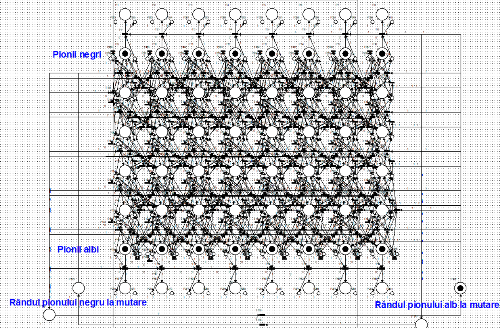

# Petri Chess Pawns Simulator

## Descriere

Petri Chess Pawns Simulator este un proiect inovator care utilizează rețele Petri pentru a simula un joc de șah cu o simplă condiție: jocul se desfășoară exclusiv cu pioni (8 pioni albi și 8 pioni negri) pe o tablă standard de șah de 8x8. Scopul jocului este de a explora dinamica și strategiile pionilor, jocul terminându-se atunci când se ajunge la un deadlock, adică momentul în care pionul care trebuie să se miște este complet blocat.

## Cum se Joacă

Jocul alternează mișcările între pionii albi și cei negri, începând cu albul. Un pion poate avansa în față cu o singură casă, cu excepția primei mișcări, când poate avansa două căsuțe. Capturarea se face în diagonală. Jocul se încheie în momentul în care un pion nu mai poate efectua nici o mișcare legală, fie din cauza blocării de către alte piese, fie din lipsa opțiunilor de capturare.

Tabla de șah este formată din 8x8

Sunt 8 pioni albi și 8 pioni negri
Pionii pot face următoarele acțiuni
- înaintează cu 1 poziție în față
- înaintează cu 2 poziții în față (doar din poziția inițială)
- pionul alb poate captura pionul negru în diagonală
- pionul negru poate captura pionul alb în diagonală
- mișcările pionilor se produc aleator
- jocul se termină doar dacă pionii albi sau negri sunt blocați și nu pot înainta sau captura alt pion

  pionii albi sunt reprezentați prin 2 jetoane (1 jeton în centru și 1 jeton în partea dreapta)

  pionii negri sunt reprezentați prin 2 jetoane (1 jeton în centru și 1 jeton în partea stângă)

