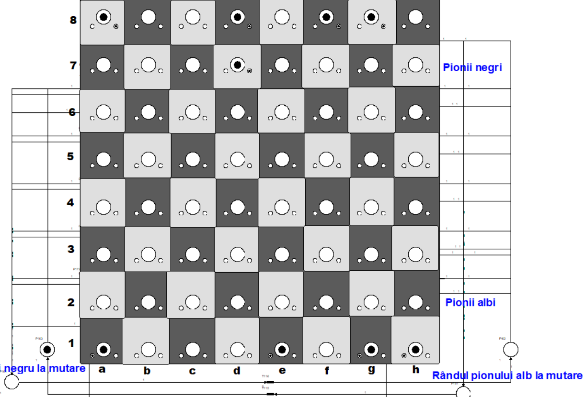

# Petri Chess Pawns Simulator

## Descriere

Petri Chess Pawns Simulator este un proiect inovator care utilizează rețele Petri pentru a simula un joc de șah cu o simplă condiție: jocul se desfășoară exclusiv cu pioni (8 pioni albi și 8 pioni negri) pe o tablă standard de șah de 8x8. Scopul jocului este de a explora dinamica și strategiile pionilor, jocul terminându-se atunci când se ajunge la un deadlock, adică momentul în care pionul care trebuie să se miște este complet blocat.

  pionii albi sunt reprezentați prin 2 jetoane (1 jeton în centru și 1 jeton în partea dreaptă)

  pionii negri sunt reprezentați prin 2 jetoane (1 jeton în centru și 1 jeton în partea stângă)

### Obiectivul Simulării

Obiectivul principal al Petri Chess Pawns Simulator este de a oferi o înțelegere aprofundată a scenariilor potențiale în jocul de șah limitat la mișcările pionilor și de a identifica condițiile care duc la un deadlock. Acest lucru permite explorarea complexității și frumuseții jocului de șah, chiar și într-un cadru restrâns la cele mai fundamentale piese.

## Reguli și Mecanica Simulării

Simularea Petri Chess Pawns utilizează o tablă de șah standard formată din 64 de căsuțe, organizate în 8 rânduri și 8 coloane. În acest scenariu, sunt prezente doar 16 piese - 8 pioni albi și 8 pioni negri, fiecare echipă având pionii plasați pe rândul său inițial conform regulilor tradiționale ale șahului.

### Acțiunile Pionilor

Pionii în această simulare sunt capabili să efectueze următoarele mișcări, conform regulilor standard ale șahului, cu câteva adaptări specifice pentru acest context simplificat:

- **Înaintarea:** Un pion poate avansa cu o singură poziție înainte pe tablă pentru a ocupa o casă liberă. Excepția este prima mișcare a pionului, când acesta are opțiunea de a avansa două poziții în față.

  
  
- **Capturarea:** Pionii au capacitatea de a captura pionii adversi în diagonală. Astfel, un pion alb poate elimina un pion negru din joc prin mișcare în diagonală spre stânga sau dreapta, și invers pentru pionii negri.
- **Generarea Mișcărilor:** Toate mișcările pionilor în cadrul acestei simulări sunt generate aleator, reflectând diferite scenarii posibile într-un joc de șah limitat la interacțiunile dintre pioni.
- **Condiția de Terminare a Jocului:** Simularea se încheie atunci când toți pionii unei culori sunt blocati și nu pot efectua nicio mișcare legală - fie înaintare, fie capturare. Aceasta situație reprezintă un deadlock, demonstrând limitările strategice într-un joc exclusiv de pioni.

### Scopul Simulării

Scopul principal al acestei simulări este de a analiza și a înțelege comportamentul pionilor în diverse situații de joc, identificând strategiile care maximizează eficacitatea mișcărilor și condițiile care conduc la un deadlock. Prin folosirea rețelelor Petri, simularea oferă o perspectivă unică asupra dinamicii și strategiilor posibile într-un joc de șah simplificat.

Este important de remarcat că această simulare nu este un joc interactiv și nu permite jucătorilor să facă mișcări. În schimb, ea demonstrează posibilitățile și limitările strategice ale pionilor într-un context de joc simplificat, utilizând modelarea prin rețele Petri pentru a analiza logic comportamentul pieselor de șah.

